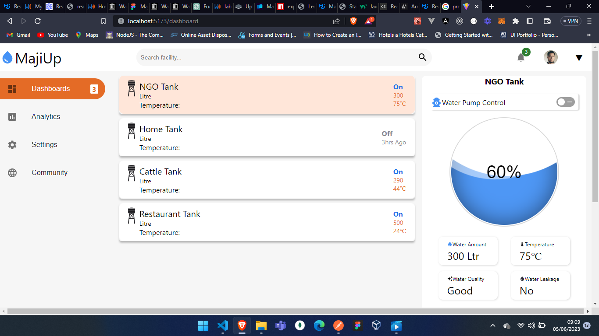
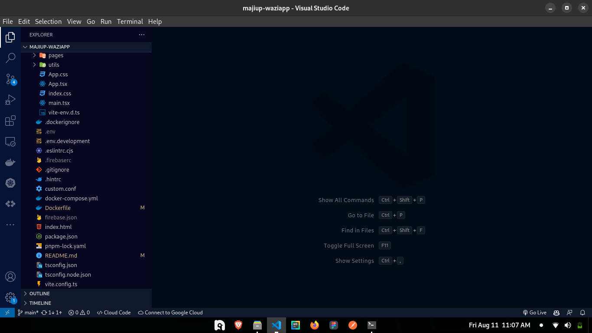

# MajiUp

## These are the instructions to install the Majiup app on your Wazigate.

Here is the screenshot of the landing page


# Getting Started

These instructions will get you a copy of the project up and running on your local machine for development and testing purposes.

## Prerequisites

What things you need to install the software and how to install them

1. [Node.js](https://nodejs.org/en/download/) - The JavaScript runtime
2. [pnpm](https://pnpm.js.org/en/installation) - The package manager
3. [Git](https://git-scm.com/downloads) - The version control system
4. Wazigate - The IoT gateway
5. [Docker](https://docs.docker.com/get-docker/) - The containerization platform

## Installing in local machine

A step by step series of examples that tell you how to get a development env running

1. Clone the repo
   ```
       git clone <url>
   ```
2. Navigate to project directory
   ```
       cd majiup-waziapp
   ```
3. Install dependencies
   ```
       pnpm install
   ```
4. Run the app
   ```
       pnpm dev
   ```

## Compiling applications

1. After we have finished building our applications, it is now time to build and compile them to run in the wazigate.
   Navigate the the project's directory, ensure you have ftp, docker and docker compose installed in your PC. If you don't have them installed, you can install them by following the instructions [here](https://docs.docker.com/get-docker/) and [here](https://docs.docker.com/compose/install/).

- Now open the folder in your favourite code editor, I prefer [Visual Studio code](https://code.visualstudio.com).
- When you do this, you will see the folder directories.
  
- but pay attention to the Dockerfile file, you will see it has an environment variable written `ENV VITE_BACKEND_URL="http://192.168.1.245:8081"`. This is the IP address of the wazigate, you need to change it to the IP address of your wazigate, it can be something like `ENV VITE_BACKEND_URL="http://<YOUR_IP_ADDRESS>:8081"`

2. Now run the following command to build the docker image
   ```
       sudo docker build --platform linux/arm64  -t frontend .
   ```
   With this command, you will build the docker image for the application to work on the Wazigate, which only supports arm64 architecture arm arm64, aarch64 and arm64/v8.
3. Similarly, navigate to the folder where you have the backend application and run the following command
   ```
       sudo docker build --platform linux/arm64  -t backend .
   ```
4. After successfully building the images, we need to save the images in a **.tar** file
   ```
       sudo docker save -o backend.tar backend
   ```
   ```
       sudo docker save -o frontend.tar frontend
   ```
5. This will create a tar file in your PC's current directory, you can list them by running the following command
   ```
       ls
   ```
6. For us to copy the files to the wazigate, we need to change permissions
   ```
       sudo chmod 777 frontend.tar
   ```
   ```
       sudo chmod 777 backend.tar
   ```

## Installing in Wazigate

1. After building the images, now we need to transfer the images to our wazigate, ensure you are connected to the same network with the wazigate.
   - Test if you have successfully installed the ftp server by running the following command
     ```
         ftp <ip_address>
     ```
     You will be prompted to enter your username and password, enter the username (pi) and password (loragateway). If you are able to login, then you have successfully installed the ftp server.
   - Inside your host PC, Navigate to the folder you built the two **.tar** files and then run the following command
     ```
         ftp <Wazigate IP Address>
     ```
     You will be prompted to enter your username and password, enter the username (upload) and password (loragateway). If you are able to login, then you have successfully installed the ftp server.
   - Now copy the contents of the application into the folder you just created
     ```
         put frontend.tar
     ```
     ```
         put backend.tar
     ```
   - We also need to copy our compose file to spin the two containers easily, navigate to the directory where you hve the **docker-compose.yml** file
     ```
         put docker-compose.yml
     ```
     With this command, you will copy the contents from the host machine application into wazigate the folder you just created. Now exit the ftp server by typing the following command
     ```
         exit
     ```
2. After successfully transferring the files to the wazigate.
   - ssh into your Wazigate
     ```
         ssh pi@<ip_address>
     ```
     The password is loragateway by default.
   - To ensure the files we copied successfully run this
     ```
         ls
     ```
     you should be able to see the files,
   - Now let us load the images from the **tar** files
     ```
         sudo docker image load -i frontend.tar
     ```
     ```
         sudo docker image load -i backend.tar
     ```
   - This will unpack the two files and add them to the docker registry as images, you can view the images by running
     ```
         sudo docker image ls
     ```
     With this command, you will see the two images frontend and backend
   - After succesfull unpacking, run the following command to check if the image is present
     ```
         docker images
     ```
     You should see the image you just built with it's name and tag. Copy the image id.
   - Now, we need to start the containers, this is where our compose file comes in handy, navigate to the directory you have the compose file and run thet following
     ```
         sudo docker-compose up
     ```
     By default, docker-compose looks for a **docker-compose.yml** file. If the compose file is named differently, there's an option to specify the file
     ```
         sudo docker-compose -f <name of your compose file> up
     ```
     With this command, you will run the two application, you can be able to see them running throug the printing in your console, if you want them to run in the background, stop the running instance then run the following
     ```
         sudo docker-compose -f <name of your compose file> -d up
     ```
3. Now
   - run the following command to check if the containers are running
     ```
         sudo docker ps
     ```
   - You should see the container you just created with it's name and id.
     Now, we need to see if the application is running. To do that, we need to check the logs of the container. To do that, run the following command
     ```
         sudo docker logs <container_id or container_name>
     ```
   - Navigate to your browser, type the ip address of your Wazigate and the port you exposed the application to. For example, if you exposed the application to port 5173, then you should type `http://<ip_address>:5173`. You should see the application running.
